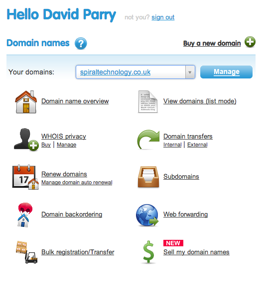
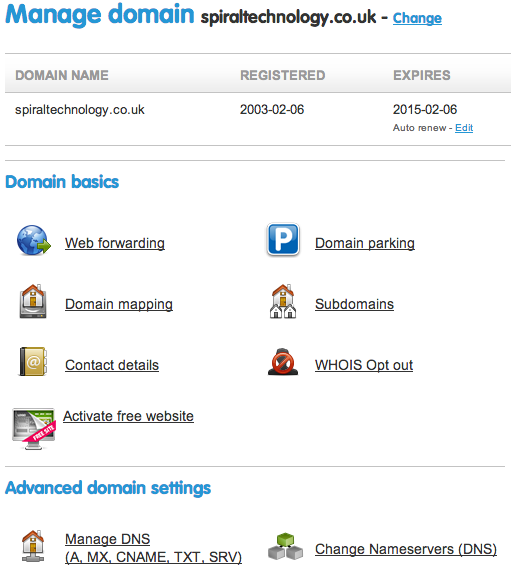
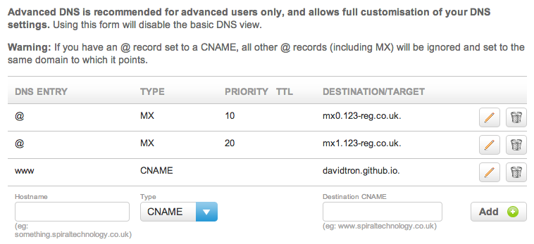

After [building](../building-static-blog/index.html) this blog statically and pushing it up to GitHub as a project page,
I then wanted to point my domain at it.

<span class="more"></span>

My intention is to point the www subdomain of spiraltechnology.co.uk at my static website hosted by GitHub at [http://davidtron.github.io](http://davidtron.github.io)

1.  In the root of my website create a file called [CNAME](https://github.com/davidtron/spiraltechnology-website/blob/master/contents/CNAME) and put the name of my subdomain in it *www.spiraltechnology.co.uk*.
    Since my site is generated by wintersmith, I needed to drop the file into the contents directory before generating the site.
    This is then generated by wintersmith into my deployment directory and pushed to my GitHub userpage repository

```bash
cd ~/dev/spiraltechnology-website
wintersmith build
cd ~/dev/spiraltechnology-website-deploy
git add CNAME
git commit -a -m "Adding the CNAME for custom domain"
git push origin master
```

2.  The next step is to configure my DNS so that any requests for www.spiraltechnology.co.uk point to my GitHub user page.
    The help pages at [GitHub ][1] suggest that this is done using a CNAME entry at your domain provider.
    My domain is hosted with [123-reg](http://123-reg.co.uk) and it's relatively straightforward to update DNS entries for domains you own.
    Log on to 123 and you will be presented with your control panel

    

    Find the domain you want to manage from the drop down and select 'Manage'
    

    Under the Advance domain settings, select 'Manage DNS'
    

    Finally add an entry for the subdomain (www.spiraltechnology.co.uk) pointing to the github userpage (davidtron.github.io)


[1]: https://help.github.com/articles/setting-up-a-custom-domain-with-pages