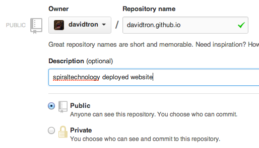

After 2 years of inactivity, I decided to resurrect my blog as a place to store technical snippets.  Previously I wrote my blog using [Jekyll](http://jekyllrb.com/), but did not get on with Ruby and constant Gem updates, so am giving [Wintersmith](http://wintersmith.io/) a try, it's built on top of node.js, easy to install and under active development.

Last time I ground to a halt because my laptop was stolen before I backed up the code anywhere, so I'll be pushing the source to GitHub and trying out their user pages for hosting.

<span class="more"></span>
1.  Install node.js I chose to [download](http://nodejs.org/download/) the package and install it, but it's available on  brew as well.

2.  Install [wintersmith](https://github.com/jnordberg/wintersmith#quick-start) using npm.  The -g option makes it globally available.

    ```bash
    sudo npm install wintersmith -g
    ```

3. As I had decided that I be wanted to store the source of the website and host the output on GitHub, I needed to create a repository to show my user pages and a repository to store the source code of the website. 

    The user pages are created in the format *username.github.io* so in my case I created a public repository named davidtron.github.io 
    

    I then created another repository for the sourcecode called spiraltechnology-website

4.  Open a terminal and check out the empty repository, in my case into my dev directory.

    ```bash
    cd ~/dev
    git clone https://github.com/davidtron/spiraltechnology-website
    ```

5.  Create a new website, by default wintersmith will create you a basic blog structure with a plugin to render blog articles and an rss feed.  It complains if the directory exists, but in this case I want to populate the directory of my empty spiraltechnology-website repo, so I used the --force flag.

    ```bash
    wintersmith new spiraltechnology-website --force
    cd spiraltechnology-website
    wintersmith preview
    ```

    The first problem I had was 

    ```bash
    template archive.jade: /Users/david/dev/spiraltechnology-website/
    templates/layout.jade: > 1| !!! 5
    ```

    Looks like the version in npm is not yet up to date with the version on github.  To fix follow it's advice and *replace !!! 5* with *doctype html*

    ```bash
    nano -w /Users/david/dev/spiraltechnology-website/templates/layout.jade
    ```
    
    Once done you can view the site in a browser on localhost:8080

6.  After creating some content and tweaking the layout and css, I added my files, commited them to my local repo then pushed the changes up to github.

    ```bash
    cd ~/dev/spiraltechnology-website-deploy
    git add *
    git commit -a -m "First pages commit. WIP"
    git push origin master
    ```

7.  Once happy with the site, you need to configure wintersmith to build the flat files to a local directory and the contents on this directory needs to be [published to the username.github.io repository](http://pages.github.com/) we created earlier.

    Checkout the empty repository

    ```bash
    cd ~/dev
    git clone https://github.com/davidtron/davidtron.github.io.git spiraltechnology-website-deploy
    cd spiraltechnology-website-deploy
    git checkout master
    ```

6.  Configure wintersmith to build to the deploy directory. This is controlled by adding an output option to config.json in the root of the directory wintersmith created for us.

    ```javascript
    {
      "locals": {
        "url": "http://www.spiraltechnology.co.uk",
        "name": "spiraltechnology",
        "owner": "David",
        "description": "simple, pragmatic, elegant code"
      },
      "output" : "../spiraltechnology-website-deploy"
      ...
    }
    ```

7.  In the source directory compile the website, it should output it into the newly created deployment directory
    ```bash
    cd ~/dev/spiraltechnology-website
    wintersmith build
    ```

8. Add the files in the github pages branch and push it up to the server.

    ```bash
    cd ~/dev/spiraltechnology-website-deploy
    git add *
    git commit -a -m "First pages commit."
    git push origin master
    ```

9.  Check that it's published after a few minutes at http://davidtron.github.io